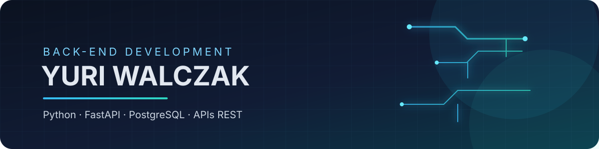

  

<h1 align="center">Olá, eu sou Yuri Walczak</h1>

  <strong>Desenvolvedor Back-end</strong> 
  Python · FastAPI · PostgreSQL · APIs REST · Automação · Integração de Sistemas

  
  

---

## Sobre mim

Sou desenvolvedor back-end apaixonado por tecnologia e por criar soluções que resolvem problemas reais. Meu foco é construir aplicações escaláveis com **Python, FastAPI, PostgreSQL** e integrações entre sistemas.

Atualmente, estou aprofundando meus conhecimentos em arquitetura de software, APIs REST, boas práticas de desenvolvimento e construção de produtos SaaS.

## Tecnologias

  

## Atualmente estudando

| Tema | Objetivo |
| --- | --- |
| Arquitetura de software | Projetar sistemas mais organizados, escaláveis e fáceis de manter. |
| Clean Architecture | Separar responsabilidades e reduzir o acoplamento entre componentes. |
| Docker | Padronizar ambientes de desenvolvimento e implantação. |
| Microsserviços | Entender estratégias de decomposição e comunicação entre serviços. |
| Testes automatizados | Aumentar a confiabilidade e a qualidade do código. |
| Design Patterns | Aplicar soluções reutilizáveis para problemas recorrentes. |

## Estatísticas

  

## Projetos em destaque

### Nexora Systems

Plataforma SaaS desenvolvida para integrar Discord, APIs e servidores FiveM, com foco em autenticação, controle de permissões, integração com Discord, PostgreSQL e arquitetura modular.

**Tecnologias:** Python · FastAPI · PostgreSQL · Discord.py · REST API · Git

### [Knowledge Base](https://github.com/YuriWolczak/knowledge-base)

Biblioteca de conhecimento sobre programação, desenvolvimento de software e tecnologia, com tutoriais, exercícios, desafios e projetos práticos.

## Objetivos

- Desenvolver soluções escaláveis e bem documentadas.
- Construir produtos SaaS que resolvam problemas concretos.
- Criar APIs modernas, seguras e fáceis de integrar.
- Evoluir continuamente como desenvolvedor.
- Compartilhar conhecimento por meio dos meus projetos.

## Contribuições

  

## Filosofia

> Tecnologia de qualidade é aquela que resolve problemas reais com simplicidade, organização e escalabilidade.

---

  Obrigado pela visita. Fique à vontade para explorar meus repositórios ou entrar em contato.

  <strong>Sempre aberto a aprender, colaborar e desenvolver novas soluções.</strong>

